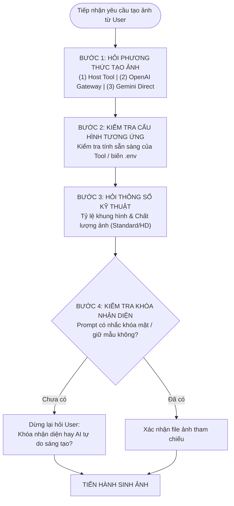

# Image Generate Skill (Host Agent Built-in, OpenAI Gateway & Google AI Studio Direct)

Kỹ năng tạo và chỉnh sửa hình ảnh chuyên nghiệp phục vụ chu trình sản xuất video ngắn chuẩn phong cách KOC (YouTube Shorts, TikTok, Instagram Reels), tối ưu hóa tỷ lệ dọc 9:16, bảo toàn chân dung KOC và chi tiết phom dáng sản phẩm thương mại.

Kỹ năng vận hành linh hoạt với 3 phương thức tạo ảnh độc lập:
1. **Host Agent Built-in Tool** (`generate_image`): Tích hợp trực tiếp trong phiên chat của AI Agent.
2. **OpenAI Compatibility Gateway** (`AI_IMAGE_USE_GEMINI=false`): Gọi qua Gateway tương thích chuẩn OpenAI `/v1/images/generations` (9router, OmniRoute, LocalAI...) với các model cao cấp như `cx/gpt-5.6-sol-image`, DALL-E-3.
3. **Gemini AI Studio Direct** (`AI_IMAGE_USE_GEMINI=true`): Bỏ qua proxy trung gian, gọi trực tiếp API chính hãng của Google Generative Language với model Imagen-3 (`imagen-3.0-generate-002`).

---

## 1. Tổng quan Kỹ năng & Đặc tính Portable (Zero Dependencies)

Module `image-generate` được thiết kế theo kiến trúc **Portable (Tự cung tự cấp)**:

- **100% Pure Python (Zero External Dependencies)**: Toàn bộ script CLI thực thi được lập trình bằng thư viện chuẩn của Python (`urllib`, `base64`, `json`, `pathlib`, `ssl`, `mimetypes`, `argparse`). Tuyệt đối không phụ thuộc vào bất kỳ thư viện bên thứ ba nào (như `openai`, `requests`, `pillow` hay `httpx`).
- **Khả năng Đóng gói & Tái sử dụng**: Có thể sao chép nguyên khối thư mục `.agents/skills/image-generate/` sang bất kỳ dự án AI Agent, FastAPI tool hub hay server headless nào mà không cần tạo môi trường ảo mới hay cài thêm package.
- **Tương thích Đa nền tảng**: Hoạt động đồng nhất trên Windows (PowerShell/CMD), Linux (Bash) và macOS.

### Cấu trúc Thư mục Kỹ năng:
```
.agents/skills/image-generate/
├── README.md                      # Tài liệu kỹ thuật chi tiết & Cẩm nang vận hành toàn diện (file này)
├── SKILL.md                       # Bản đặc tả kỹ năng, cây quyết định và giao thức tương tác của Agent
├── references/
│   ├── prompting_guide.md         # Cẩm nang kỹ thuật viết Prompt: Chân dung KOC, góc máy 9:16, ánh sáng studio, chất liệu vải
│   └── openai_compat_spec.md      # Đặc tả kỹ thuật payload HTTP API OpenAI Compatibility
└── scripts/
    └── generate_image.py          # Script CLI thuần Python chạy độc lập (Gateway & Google Direct)
```

---

## 2. Ma trận Biến môi trường (.env & .env.example) & 2 Chế độ Độc lập

Hệ thống tự động tìm và nạp cấu hình từ file `.env` tại thư mục làm việc hiện tại hoặc thư mục gốc của dự án. Module tạo ảnh được điều khiển bởi nhóm biến `AI_IMAGE_*`.

> [!IMPORTANT]
> **Biến `AI_IMAGE_MODEL` là BẮT BUỘC và TUYỆT ĐỐI KHÔNG ĐƯỢC ĐỂ TRỐNG trong cả 2 chế độ!** Hệ thống không còn sử dụng model mặc định ngầm nhằm tránh phát sinh chi phí hoặc sinh ảnh sai model.

### Bảng Ma trận Biến Môi trường Tạo Ảnh:

| Tên biến môi trường | Kiểu dữ liệu | Bắt buộc? | Mô tả chi tiết & Quy chuẩn cấu hình |
|---|---|:---:|---|
| `AI_IMAGE_ENABLE` | `boolean` (`true`/`false`) | Có | Bật (`true`) hoặc tắt (`false`) tính năng tạo ảnh AI trong toàn hệ thống. |
| `AI_IMAGE_USE_GEMINI` | `boolean` (`true`/`false`) | Có | Cờ rẽ nhánh chế độ: `false` = Dùng OpenAI Compatibility Gateway; `true` = Gọi trực tiếp Google AI Studio Imagen-3. |
| `AI_IMAGE_API_KEY` | `string` | **BẮT BUỘC** | Khóa API Key tạo ảnh: Token Gateway (`sk-...`) khi dùng Gateway, hoặc Google Gemini Key (`AIzaSy...`) khi dùng Google Direct. |
| `AI_IMAGE_ENDPOINT_URL` | `string` (URL) | Theo chế độ | URL endpoint nhận request: Bắt buộc khi dùng Gateway (vd: `https://9router.phuonganh.io.vn/v1/images/generations`). Bỏ qua/để trống khi dùng Google Direct. |
| `AI_IMAGE_MODEL` | `string` | **BẮT BUỘC** | Tên model tạo ảnh. Ví dụ Gateway: `cx/gpt-5.6-sol-image,dall-e-3`. Ví dụ Google Direct: `imagen-3.0-generate-002`. **TUYỆT ĐỐI KHÔNG ĐỂ TRỐNG!** |
| `AI_IMAGE_SOURCE_WIDTH` | `integer` (pixel) | Không | Chiều rộng chuẩn hóa của ảnh gốc khi trích xuất hoặc xử lý bounding box sản phẩm (mặc định: `200`). |

---

### Phân định Chi tiết 2 Chế độ Sinh Ảnh:

#### Chế độ 1: Gateway tương thích OpenAI (`AI_IMAGE_USE_GEMINI=false`)
- **Nguyên lý hoạt động**: Gửi payload JSON chuẩn `POST /v1/images/generations` đến dịch vụ Gateway trung gian (ví dụ: 9router, OmniRoute, LocalAI, vLLM hoặc OpenAI chính thức).
- **Mẫu cấu hình trong `.env`**:
  ```env
  AI_IMAGE_ENABLE=true
  AI_IMAGE_USE_GEMINI=false
  AI_IMAGE_API_KEY=sk-f20267789586c481-8of9dl-970b9fd9
  AI_IMAGE_ENDPOINT_URL=https://9router.phuonganh.io.vn/v1/images/generations
  AI_IMAGE_MODEL=cx/gpt-5.6-sol-image
  AI_IMAGE_SOURCE_WIDTH=200
  ```
- **Các model tương thích**: `cx/gpt-5.6-sol-image`, `cx/gpt-image-2`, `cx/gpt-image-2.5`, `dall-e-3`, `flux-pro`...

#### Chế độ 2: Google AI Studio Direct (`AI_IMAGE_USE_GEMINI=true`)
- **Nguyên lý hoạt động**: Bỏ qua endpoint trung gian, kết nối trực tiếp đến Google Generative Language API chính hãng (`https://generativelanguage.googleapis.com/v1beta/models/{model}:predict`).
- **Mẫu cấu hình trong `.env`**:
  ```env
  AI_IMAGE_ENABLE=true
  AI_IMAGE_USE_GEMINI=true
  AI_IMAGE_API_KEY=AIzaSyD...your_actual_google_key
  AI_IMAGE_ENDPOINT_URL=
  AI_IMAGE_MODEL=imagen-3.0-generate-002
  AI_IMAGE_SOURCE_WIDTH=200
  ```
- **Các model tương thích**: `imagen-3.0-generate-002`, `imagen-3.0-fast-generate-001` hoặc các model Imagen mới nhất của Google.

---

## 3. Quy tắc Tương tác Bắt buộc 4 Bước (Sequential Interview Protocol)

> [!CAUTION]
> **QUY TẮC BẤT DI BẤT DỊCH CHO AI AGENT**:
> 1. **KHÔNG TỰ Ý CHỌN PHƯƠNG THỨC MẶC ĐỊNH**: Luôn hỏi người dùng lựa chọn phương thức tạo ảnh trước khi tiến hành.
> 2. **KHÔNG TỰ Ý GÁN NGẦM THÔNG SỐ**: Tuyệt đối không tự gán ngầm tỷ lệ khung hình hay chất lượng ảnh nếu người dùng chưa nêu rõ.
> 3. **BẮT BUỘC KIỂM TRA KHÓA NHẬN DIỆN**: Nếu trong câu lệnh chưa đề cập việc khóa mặt KOC / giữ nhân vật, Agent phải dừng lại hỏi xác nhận.



### Chi tiết 4 Bước Phỏng vấn Tuần tự:

### Bước 1: Hỏi Người dùng Lựa chọn Phương thức Tạo ảnh
Agent xuất câu hỏi mời người dùng chọn 1 trong 3 phương thức:
> *"Chào bạn! Để tạo hình ảnh đúng chuẩn và phù hợp nhất với nhu cầu, bạn muốn tạo ảnh bằng phương thức nào sau đây?*
> 1. **Host Agent Built-in Tool**: Tạo trực tiếp qua công cụ nội bộ `generate_image` của Agent.
> 2. **OpenAI Compatibility Gateway**: Tạo qua Gateway tương thích OpenAI (model: `cx/gpt-5.6-sol-image`, DALL-E-3...).
> 3. **Gemini AI Studio (Google Direct)**: Tạo trực tiếp qua Google Imagen-3 bằng Google API Key cá nhân.*"

### Bước 2: Kiểm tra Cấu hình Tương ứng trong `.env`
- Nếu chọn **(1) Host Tool**: Kiểm tra xem phiên làm việc hiện tại có công cụ `generate_image` không. Nếu không có (môi trường headless/CLI thuần), thông báo ngay và hướng dẫn chuyển sang phương thức (2) hoặc (3).
- Nếu chọn **(2) OpenAI Gateway**: Kiểm tra `.env` xem đã có `AI_IMAGE_API_KEY`, `AI_IMAGE_ENDPOINT_URL`, `AI_IMAGE_MODEL` chưa. Nếu thiếu, xuất hướng dẫn bổ sung dòng cấu hình vào `.env`.
- Nếu chọn **(3) Gemini Direct**: Kiểm tra `.env` xem đã có `AI_IMAGE_API_KEY` (khóa `AIzaSy...`) và `AI_IMAGE_MODEL` chưa. Nếu thiếu, hướng dẫn lấy key tại Google AI Studio.

### Bước 3: Xác nhận Tỷ lệ Khung hình và Chất lượng Ảnh
Agent hỏi rõ 2 thông số kỹ thuật (nghiêm cấm tự gán ngầm nếu thiếu):
> *"Cấu hình phương thức đã sẵn sàng. Vui lòng cho mình biết thêm 2 thông số kỹ thuật:*
> 1. **Tỷ lệ khung hình / Kích thước**: Bạn muốn xuất ảnh tỷ lệ nào? (Ví dụ: `9:16` dọc cho Shorts/TikTok/Reels, `1:1` vuông, hay `16:9` ngang?)
> 2. **Chất lượng ảnh**: Bạn chọn `standard` (nhanh, tiết kiệm credit) hay `hd` (sắc nét, chi tiết cao)?*"

### Bước 4: Kiểm tra và Hỏi về Khóa Nhận Diện (Identity Lock / Consistency)
- Agent quét câu lệnh của người dùng để tìm các từ khóa nhận diện: `"khóa mặt"`, `"giữ nguyên mặt"`, `"không vẽ lại mặt"`, `"lock identity"`, `"consistency"`, `"giữ nhân vật"`, `"ảnh mẫu"`, `"mặt KOC"`, `"reference image"`.
- **Rẽ nhánh**:
  - **Trường hợp ĐÃ CÓ đề cập**: Xác nhận đường dẫn file ảnh mẫu (ví dụ: `01_dau_vao/koc/face.jpg` hoặc ảnh sản phẩm thực tế) để đưa vào tham số tham chiếu (`ImagePaths` cho Host Tool, `--ref-image` cho CLI).
  - **Trường hợp CHƯA đề cập**: Agent **BẮT BUỘC DỪNG LẠI** và hỏi:
    > *"Bạn có muốn **khóa nhận diện** (giữ nguyên khuôn mặt KOC / nhân vật từ ảnh mẫu sẵn có) hay để AI **tự do sáng tạo** nhân vật mới?"*
  - Nếu người dùng chọn khóa nhận diện: Yêu cầu cấp file ảnh mẫu và kích hoạt Image-to-Image.
  - Nếu người dùng chọn tự do sáng tạo: Thực hiện Text-to-Image thuần túy.

---

## 4. Cơ chế Quota Handling & Failover (Xử lý khi Host Tool hết Quota / 429)

Khi người dùng chọn phương thức **(1) Host Agent Built-in Tool**, trong quá trình gọi tool `generate_image` có thể phát sinh lỗi cạn kiệt tài nguyên (`Quota exceeded`, `Rate limit exceeded`, `429 Too Many Requests`, `Resource has been exhausted` hoặc `credits depleted`).

### Quy trình Xử lý Chuyển đổi (Failover Protocol):
1. **Không im lặng, không tự ý hủy tác vụ**: Tuyệt đối không bỏ dở quy trình hoặc báo lỗi chung chung.
2. **Minh bạch hóa nguyên nhân**: Giải thích rõ ràng Host Agent hiện tại đã đạt giới hạn quota của phiên làm việc.
3. **Kích hoạt luồng chuyển đổi phương thức**: Chủ động mời người dùng chuyển sang 2 phương thức độc lập còn lại.
4. **Bảo lưu thông số**: Sau khi người dùng chọn phương thức thay thế, tái sử dụng toàn bộ thông số đã chốt ở Bước 3 (Tỷ lệ, Chất lượng) và Bước 4 (Khóa nhận diện), quay lại Bước 2 để kiểm tra `.env` và tiến hành sinh ảnh ngay.

### Mẫu Thông báo Điều hướng Failover Chuẩn:
> ⚠️ **Thông báo giới hạn Quota Host Agent:**
> 
> Công cụ nội bộ `generate_image` của Agent hiện đã đạt hạn mức lượt tạo ảnh trong phiên làm việc này (*Quota / Rate Limit Exceeded*).
> 
> Để không làm gián đoạn tiến độ sản xuất video, bạn vui lòng chọn chuyển sang một trong hai phương thức thay thế độc lập:
> 1. **OpenAI Compatibility Gateway** (Chạy qua Gateway với model `cx/gpt-5.6-sol-image`)
> 2. **Gemini AI Studio Direct** (Chạy trực tiếp qua Google Imagen-3 API)
> 
> Vui lòng nhập `1` hoặc `2` để mình kiểm tra cấu hình `.env` và tiếp tục tạo ảnh ngay cho bạn!

---

## 5. Quy chuẩn Đầu ra Kết quả (Output Presentation Standard)

Khi ảnh được sinh thành công và lưu vào thư mục phân cảnh, Agent bắt buộc phải trình bày phản hồi theo đúng cấu trúc chuẩn mực sau:

### Cấu trúc Phản hồi Bắt buộc:
1. **Phương thức đã sử dụng**: Nêu rõ phương thức tạo (Host Agent Tool / OpenAI Compatibility Gateway / Gemini AI Studio Direct) và model thực tế.
2. **Thông tin kỹ thuật ảnh**:
   - Tỷ lệ khung hình & Kích thước pixel (ví dụ: `9:16` - `1024x1792`).
   - Chất lượng ảnh (`standard` hoặc `hd`).
   - Trạng thái khóa nhận diện: Có sử dụng ảnh tham chiếu hay không.
   - Đường dẫn file lưu trữ cục bộ.
   - Dung lượng file thực tế.
3. **Prompt thực tế sử dụng**: **BẮT BUỘC** đặt nguyên văn trong khối code block:
   ````text
   ```text
   <Toàn bộ nội dung prompt thực tế đã gửi đến mô hình AI>
   ```
   ````

### Mẫu Phản hồi Trả về Chuẩn Thực tế:
> 🎉 **Tạo ảnh phân cảnh thành công!**
> 
> - **Phương thức thực hiện**: OpenAI Compatibility Gateway (`AI_IMAGE_USE_GEMINI=false`)
> - **Model**: `cx/gpt-5.6-sol-image`
> - **Tỷ lệ & Kích thước**: `9:16` (`1024x1792`)
> - **Chất lượng**: `hd`
> - **Khóa nhận diện**: Đã áp dụng tham chiếu từ `01_dau_vao/koc/face_sample.jpg`
> - **File kết quả**: `sessions/20260922_0620_thu_trang/04_canh/v001/S01/visual.png` (`1.52 MB`)
> 
> **Prompt thực tế đã sử dụng:**
> ```text
> Chân dung KOC nữ người Việt 22 tuổi, diện mạo và đường nét khuôn mặt giữ nguyên theo ảnh tham chiếu, nụ cười tươi tắn tự nhiên, đang cầm và giới thiệu chiếc áo polo màu xanh navy vải cotton cá sấu cao cấp. Góc máy ngang ngực 85mm f/1.8, ánh sáng studio mềm mại, hậu cảnh bokeh quán cà phê hiện đại nhạt mờ, khung hình dọc 9:16 chuẩn Shorts, chất lượng hình ảnh chân thực 4K, rõ từng thớ sợi dệt vải.
> ```

---

## 6. Hướng dẫn CLI & Bảng Tham số `scripts/generate_image.py`

Script CLI `generate_image.py` chạy độc lập thuần Python, tự động đọc `.env` hoặc nhận tham số ghi đè qua command line.

### Bảng Tham số CLI Đầy đủ:

| Tham số | Viết tắt | Kiểu dữ liệu | Mặc định | Bắt buộc? | Ý nghĩa & Mô tả |
|---|:---:|:---:|:---:|:---:|---|
| `--prompt` | `-p` | `string` | `None` | Có* | Câu lệnh prompt mô tả nội dung bức ảnh cần tạo (*hoặc dùng `--prompt-file`). |
| `--prompt-file` | | `string` | `None` | Có* | Đường dẫn file văn bản `.txt` chứa prompt chi tiết (*hoặc dùng `--prompt`). |
| `--aspect-ratio`| | `string` | `None` | Có** | Tỷ lệ khung hình chuẩn: `9:16`, `16:9`, `1:1`, `3:4`, `4:3`, `2:3`, `3:2` (**hoặc dùng `--size`). |
| `--size` | | `string` | `None` | Có** | Kích thước pixel cụ thể (vd: `1024x1792`). Bắt buộc nếu không có `--aspect-ratio`. |
| `--quality` | | `string` | `None` | **BẮT BUỘC** | Chất lượng sinh ảnh: `standard`, `hd`, `auto`. |
| `--ref-image` | `-i` | `string` | `None` | Không | Đường dẫn ảnh tham chiếu địa phương cho tác vụ Image-to-Image / Khóa nhận diện. |
| `--model` | `-m` | `string` | Đọc từ `.env` | Không | Tên model tạo ảnh (ghi đè biến `AI_IMAGE_MODEL`). |
| `--output` | `-o` | `string` | `output_image.png`| Không | Đường dẫn file ảnh đầu ra cần lưu trữ. |
| `--api-key` | | `string` | Đọc từ `.env` | Không | Khóa API Key ghi đè `AI_IMAGE_API_KEY`. |
| `--endpoint-url`| | `string` | Đọc từ `.env` | Không | URL Endpoint ghi đè `AI_IMAGE_ENDPOINT_URL`. |
| `--use-gemini` | | cờ flag | `False` | Không | Kích hoạt gọi trực tiếp Google AI Studio API (bỏ qua Gateway). |
| `--dry-run` | | cờ flag | `False` | Không | In thông tin cấu hình và payload kiểm tra, không gọi API thực tế. |

### Bảng Ánh xạ Tỷ lệ Khung hình sang Độ phân giải Chuẩn:

| Tỷ lệ Khung hình | Độ phân giải Pixel (`size`) | Định dạng Ứng dụng Tối ưu |
|:---:|:---:|---|
| **`9:16`** | `1024x1792` | **Chuẩn dọc video ngắn**: TikTok, YouTube Shorts, Facebook/Instagram Reels, Story. |
| **`16:9`** | `1792x1024` | Video ngang toàn cảnh cho YouTube tiêu chuẩn, Facebook Watch, TV màn hình rộng. |
| **`1:1`** | `1024x1024` | Khung hình vuông cho bài đăng Instagram, Facebook Feed, Avatar, Catalogue sản phẩm. |
| **`3:4`** | `1024x1365` | Chân dung dọc thời trang, Lookbook, bài đăng Pinterest. |
| **`4:3`** | `1365x1024` | Tỷ lệ ảnh cổ điển, slide thuyết trình, tài liệu trực quan. |
| **`2:3`** | `1024x1536` | Chụp ảnh chân dung tiêu chuẩn của máy ảnh DSLR. |
| **`3:2`** | `1536x1024` | Chụp phong cảnh / ngoại cảnh tiêu chuẩn của máy ảnh DSLR. |

---

### Các Ví dụ Dòng lệnh Thực tế:

#### A. Tạo ảnh Text-to-Image cơ bản (Dọc 9:16, chất lượng HD qua Gateway)
```bash
python .agents/skills/image-generate/scripts/generate_image.py \
  --prompt "Chân dung KOC nữ người Việt 22 tuổi nụ cười tươi tắn, mặc áo polo pique cotton màu be, đứng trước quán cà phê hiện đại, ánh sáng studio mềm dịu" \
  --aspect-ratio "9:16" \
  --quality "hd" \
  --output "04_canh/v001/S01/visual.png"
```

#### B. Tạo ảnh có tham chiếu Khóa nhận diện KOC / Giữ nét sản phẩm (Image-to-Image)
```bash
python .agents/skills/image-generate/scripts/generate_image.py \
  --prompt "KOC nữ tươi cười cầm chiếc áo polo xanh navy giới thiệu trước ống kính, đường nét khuôn mặt giữ nguyên theo ảnh mẫu" \
  --ref-image "01_dau_vao/koc/face_sample.jpg" \
  --aspect-ratio "9:16" \
  --quality "hd" \
  --output "04_canh/v001/S02/visual.png"
```

#### C. Đọc Prompt từ file văn bản (.txt)
```bash
python .agents/skills/image-generate/scripts/generate_image.py \
  --prompt-file "04_canh/v001/S01/prompt.txt" \
  --aspect-ratio "9:16" \
  --quality "standard" \
  --output "04_canh/v001/S01/visual.png"
```

#### D. Chạy thử nghiệm kiểm tra cấu hình không tốn credit (`--dry-run`)
```bash
python .agents/skills/image-generate/scripts/generate_image.py \
  --prompt "Kiểm tra kết nối và cấu hình hệ thống" \
  --aspect-ratio "9:16" \
  --quality "standard" \
  --dry-run
```

#### E. Chạy trực tiếp Google AI Studio Imagen-3 (`--use-gemini`)
```bash
python .agents/skills/image-generate/scripts/generate_image.py \
  --prompt "Ảnh sản phẩm áo polo nam màu trắng đặt trên nền gỗ mộc, ánh sáng tự nhiên rọi từ cửa sổ" \
  --aspect-ratio "1:1" \
  --quality "standard" \
  --use-gemini \
  --model "imagen-3.0-generate-002" \
  --output "product_square.png"
```

---

### Đặc tả Chuẩn Đầu Ra JSON:

Script CLI trả về kết quả cấu trúc JSON qua `stdout`:

#### Kết quả Thành công khi chạy OpenAI Gateway (`AI_IMAGE_USE_GEMINI=false`):
```json
{
  "status": "success",
  "engine": "openai-compatible",
  "model": "cx/gpt-5.6-sol-image",
  "aspect_ratio": "9:16",
  "size": "1024x1792",
  "quality": "hd",
  "output_file": "D:\\Affiliate\\04_Tools\\idea_to_video_v2 - gemini\\04_canh\\v001\\S01\\visual.png",
  "file_size_bytes": 1542300,
  "media_type": "image/png",
  "revised_prompt": "A Vietnamese 22-year-old female creator presenting a pique cotton navy polo..."
}
```

#### Kết quả Thành công khi chạy Google Direct (`AI_IMAGE_USE_GEMINI=true`):
```json
{
  "status": "success",
  "engine": "google-ai-studio",
  "model": "imagen-3.0-generate-002",
  "aspect_ratio": "9:16",
  "size": "1024x1792",
  "quality": "standard",
  "output_file": "D:\\Affiliate\\04_Tools\\idea_to_video_v2 - gemini\\04_canh\\v001\\S01\\visual.png",
  "file_size_bytes": 1420580,
  "media_type": "image/png",
  "revised_prompt": "Chân dung KOC nữ người Việt..."
}
```

#### Kết quả Chạy Thử nghiệm (`--dry-run`):
```json
{
  "status": "dry_run",
  "mode": "Gateway",
  "endpoint_url": "https://9router.phuonganh.io.vn/v1/images/generations",
  "model": "cx/gpt-5.6-sol-image",
  "size": "1024x1792",
  "aspect_ratio": "9:16",
  "quality": "standard",
  "has_api_key": true,
  "api_key_length": 35,
  "ref_image": null,
  "prompt": "Kiểm tra kết nối và cấu hình hệ thống"
}
```

#### Kết quả Lỗi (`status: error`):
```json
{
  "status": "error",
  "engine": "openai-compatible",
  "model": "cx/gpt-5.6-sol-image",
  "message": "HTTP Error 401: Unauthorized - Invalid API Key"
}
```

---

## 7. Cẩm nang Xử lý Sự cố & Bảng Mã lỗi (Troubleshooting)

### Bảng Mã Lỗi Thường Gặp & Hướng Xử Lý:

| Mã lỗi / Hiện tượng | Nguyên nhân chính | Hướng xử lý khắc phục |
|---|---|---|
| **HTTP 401 Unauthorized** | Sai API Key, key hết hạn hoặc tài khoản chưa được phân quyền truy cập model | Kiểm tra lại `AI_IMAGE_API_KEY` trong file `.env`. Đảm bảo key còn hạn mức tín dụng và đúng định dạng (`sk-...` cho Gateway hoặc `AIzaSy...` cho Google). |
| **HTTP 400 Bad Request** | Model không hỗ trợ kích thước/chất lượng đã chọn, hoặc nội dung prompt vi phạm bộ lọc an toàn (Safety Filter) | 1. Kiểm tra lại tham số `--aspect-ratio` hoặc `--size`.<br>2. Kiểm tra từ ngữ trong prompt, tránh các từ nhạy cảm liên quan đến thương hiệu có bản quyền khắt khe hoặc nội dung không phù hợp. |
| **HTTP 404 Not Found** | Sai đường dẫn endpoint API | Kiểm tra lại `AI_IMAGE_ENDPOINT_URL`. Đảm bảo có hậu tố `/v1/images/generations` khi dùng Gateway tương thích OpenAI. |
| **HTTP 429 Too Many Requests / Quota Exceeded** | Vượt quá tần suất gọi API (Rate Limit) hoặc cạn hạn mức tài khoản | 1. Chờ 30-60 giây trước khi gọi lại.<br>2. Kích hoạt cơ chế Failover chuyển sang phương thức dự phòng (Gateway hoặc Google Direct).<br>3. Nạp thêm credit cho tài khoản API. |
| **HTTP 500 / 502 / 503 Server Error** | Máy chủ Gateway hoặc nhà cung cấp AI gốc tạm thời quá tải | Thử lại sau 15-30 giây, hoặc đổi model sang model dự phòng (ví dụ từ `cx/gpt-5.6-sol-image` sang `dall-e-3`). |
| **Missing Model Error / RuntimeError: Vui lòng cấu hình AI_IMAGE_MODEL** | Biến `AI_IMAGE_MODEL` trong `.env` đang để trống và không truyền qua `--model` | Điền tên model hợp lệ vào `AI_IMAGE_MODEL` trong `.env`. Hệ thống không còn dùng model mặc định ngầm. |
| **Missing API Key Error** | Cả file `.env` lẫn CLI đều không tìm thấy khóa API | Điền `AI_IMAGE_API_KEY` vào `.env` hoặc truyền qua cờ `--api-key`. |
| **FileNotFoundError** | Không tìm thấy file prompt hoặc ảnh tham chiếu `--ref-image` | Kiểm tra lại đường dẫn file; khuyến nghị sử dụng đường dẫn tuyệt đối hoặc đường dẫn tương đối chính xác từ thư mục gốc của dự án. |
| **Connection Timeout** | Thời gian render ảnh vượt quá timeout mặc định | Tăng giá trị `AI_REQUEST_TIMEOUT` trong `.env` (khuyến nghị `180` giây khi tạo ảnh HD). |

---

### Lời khuyên Vận hành Tối ưu cho AI Agent:
1. **Tuân thủ Tuyệt đối Sequential Interview Protocol**: Agent luôn phỏng vấn người dùng để lựa chọn 1 trong 3 phương thức (Host Tool, Gateway, Gemini Direct) trước khi thực hiện. Tuyệt đối không tự ý gán ngầm mặc định hay tự tiện gọi Host Tool khi chưa có sự xác nhận của người dùng.
2. **Luôn chạy `--dry-run` khi kiểm tra hệ thống**: Khi nghi ngờ cấu hình `.env` hoặc đường dẫn ảnh tham chiếu bị lỗi, chạy lệnh CLI kèm cờ `--dry-run` trước để thẩm định tính hợp lệ mà không tiêu tốn credit thực tế.
3. **Tuân thủ Vùng an toàn 9:16 (Safe Zone)**: Mọi chi tiết quan trọng về gương mặt KOC và sản phẩm thời trang phải nằm trong 70% trung tâm khung hình, chừa 15% phía dưới cho phụ đề động và giao diện ứng dụng mạng xã hội (nút like, comment, giỏ hàng sàn).

