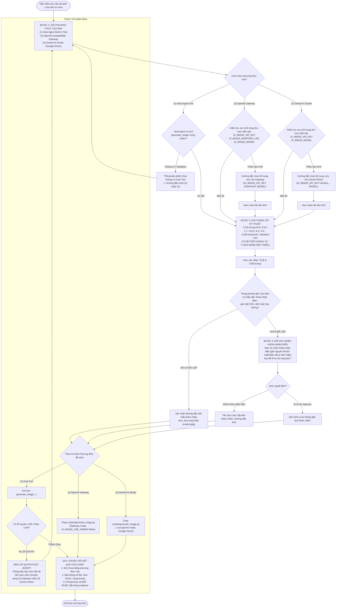

# Image Generate Skill (Host Agent Built-in, Google AI Studio & OpenAI Gateway)

Kỹ năng tạo và chỉnh sửa ảnh phục vụ sản xuất video ngắn chuẩn KOC (YouTube Shorts, TikTok, Reels) với tỷ lệ dọc 9:16 và bảo toàn chân dung nhân vật / chi tiết sản phẩm.

Skill vận hành theo kiến trúc đa luồng linh hoạt: Native Host Tool, Google AI Studio chính hãng, hoặc OpenAI Compatibility Gateway.

## Quy Chuẩn Bắt Buộc Về Thư Mục Phiên Làm Việc (Session Dir)

> [!IMPORTANT]
> **QUY TẮC CÔ LẬP DỮ LIỆU & BẢO VỆ MÃ NGUỒN**:
> Tuyệt đối **KHÔNG** xả file ảnh được tạo ra, ảnh tham chiếu mẫu hoặc script trung gian trực tiếp ra root repo hoặc `04_canh/` bừa bãi. Mọi tác vụ sinh và xử lý ảnh phải được cô lập hoàn toàn trong thư mục session chuẩn hóa.

- **Thư mục gốc:** `./scratch/`
- **Cú pháp đặt tên:** `./scratch/yyyy-mm-dd_image-generate_công-việc-viết-không-dấu`
  - Ví dụ: `./scratch/2026-09-22_image-generate_tao-anh-koc-ao-polo`
- **Cấu trúc phân vùng thư mục con bắt buộc:**
  ```text
  ./scratch/yyyy-mm-dd_image-generate_công-việc-viết-không-dấu/
  ├── input/      # Chứa ảnh tham chiếu khóa nhận diện khuôn mặt / chi tiết sản phẩm (`koc_face.jpg`, `product_detail.jpg`)
  ├── output/     # Chứa ảnh sinh ra hoàn thiện (`visual.png`, `scene_01.png`)
  ├── scripts/    # Chứa script prompt builder / batch runner riêng cho session (tuyệt đối không sửa src/)
  └── temp/       # Chứa request JSON payload, raw base64 data, tệp tạm
  ```
- **Tự động phân phối tài nguyên bằng tham số `--session-dir`:**
  - Script `generate_image.py` hỗ trợ tham số `--session-dir <đường_dẫn_session>`.
  - Khi có `--session-dir` và không truyền `--output`, script tự động lưu ảnh vào `<session_dir>/output/visual.png`.
  - Hoặc có thể truyền rõ `--output <session_dir>/output/<tên_file>.png`.

---

## 1. Sơ Đồ Quy Trình Phỏng Vấn Tuần Tự & Failover (Sequential Interview Protocol)



---

## 2. Agent Interactive Protocol (Quy Tắc Phỏng Vấn Tuần Tự 4 Bước)

> [!IMPORTANT]
> **QUY TẮC BẮT BUỘC DÀNH CHO AI AGENT TRƯỚC KHI TẠO ẢNH**:
> Tuyệt đối **KHÔNG BAO GIỜ** tự ý mặc định dùng Host Tool hoặc tự ý gán ngầm thông số nếu người dùng chưa chỉ định. Phải đi qua 4 bước:

### Bước 1: Luôn hỏi người dùng phương thức tạo ảnh
Hỏi người dùng muốn sử dụng 1 trong 3 phương thức:
1. **Host Agent Built-in Tool**
2. **OpenAI Compatibility Gateway**
3. **Gemini AI Studio Direct**

### Bước 2: Kiểm tra cấu hình (.env)
- Chỉ kiểm tra cấu hình trong file `.env` tại thư mục hiện tại (`Path.cwd() / ".env"`).
- **Tuyệt đối không** tìm kiếm ở các thư mục ngoài (ví dụ `05_Tai_Khoan_Va_ID`) hoặc dùng biến ngoài dự án.
- Nếu thiếu cấu hình (`AI_IMAGE_API_KEY`, `AI_IMAGE_ENDPOINT_URL`, `AI_IMAGE_MODEL`), hướng dẫn người dùng bổ sung.

### Bước 3: Hỏi thông số Kỹ thuật
- **Tỷ lệ khung hình / Kích thước**: `9:16`, `1:1`, `16:9`, `3:4`, `4:3`, `2:3`, `3:2`.
- **Chất lượng ảnh**: `standard` hoặc `hd`.
- Nếu thiếu, hỏi lại người dùng. TUYỆT ĐỐI KHÔNG TỰ Ý GÁN NGẦM.

### Bước 4: Kiểm tra Intent Khóa Nhận Diện (Identity Lock)
- Nếu câu lệnh người dùng **không** đề cập đến khóa nhận diện (như không tạo lại mặt, giữ nguyên, lock identity, ảnh mẫu...), Agent **BẮT BUỘC PHẢI HỎI LẠI**: 
  > *"Bạn có muốn khóa nhận diện (giữ nguyên khuôn mặt/nhân vật từ ảnh mẫu) hay để AI tự do sáng tạo?"*
- Nếu người dùng muốn khóa nhận diện, yêu cầu cung cấp đường dẫn ảnh tham chiếu (`--ref-image` cho CLI hoặc `ImagePaths` cho Host Tool).

---

## 3. Cơ Chế Quota Handling & Failover

Khi sử dụng **Host Tool** (`generate_image`), nếu công cụ trả về lỗi liên quan đến Quota / Rate Limit / 429:
- **Agent tuyệt đối không tự động dừng hay bỏ dở quy trình.**
- Phải thông báo rõ ràng cho người dùng rằng Host Agent đã hết hạn mức.
- **Hỏi lại người dùng** để chuyển sang phương thức khác: **(2) Gateway** hoặc **(3) Gemini Direct**.
- Sau khi người dùng chọn, quay lại kiểm tra `.env` của phương thức mới và tiếp tục tạo ảnh, không cần hỏi lại tỷ lệ/chất lượng nếu đã xác nhận trước đó.

---

## 4. Quy Chuẩn Trả Kết Quả (Output Presentation Standard)

Khi ảnh được tạo thành công, Agent bắt buộc phải trình bày kết quả bao gồm:
1. Nêu rõ tạo bằng **phương thức nào** (Host Tool, Gateway, hay Gemini Direct) và model nào.
2. Thông số kỹ thuật ảnh: Tỷ lệ khung hình, kích thước, chất lượng, dung lượng file, đường dẫn lưu file, trạng thái khóa nhận diện.
3. **Prompt thực tế sử dụng**: BẮT BUỘC phải đặt trong textblock markdown.

**Mẫu trả kết quả chuẩn:**
> - Phương thức: OpenAI Compatibility Gateway
> - Model: cx/gpt-5.6-sol-image
> - Tỷ lệ & Kích thước: 9:16 (1024x1792)
> - Chất lượng: hd
> - Khóa nhận diện: Đã áp dụng tham chiếu từ `./scratch/2026-09-22_image-generate_tao-anh-koc-ao-polo/input/face_sample.jpg`
> - File kết quả: `./scratch/2026-09-22_image-generate_tao-anh-koc-ao-polo/output/visual.png` (1.52 MB)
> 
> **Prompt thực tế đã sử dụng:**
> ```text
> Chân dung KOC nữ người Việt 22 tuổi, diện mạo và đường nét khuôn mặt giữ nguyên theo ảnh tham chiếu, nụ cười tươi tắn tự nhiên, đang cầm và giới thiệu chiếc áo polo màu xanh navy vải cotton cá sấu cao cấp. Khung hình dọc 9:16 chuẩn Shorts, chất lượng hình ảnh chân thực 4K, rõ từng thớ sợi dệt vải.
> ```

---

## 5. Hướng Dẫn Vận Hành CLI Script (`generate_image.py`)

Sử dụng script CLI độc lập (100% Pure Python):
[`scripts/generate_image.py`](scripts/generate_image.py)

Script rẽ nhánh dựa vào `AI_IMAGE_USE_GEMINI` hoặc flag `--use-gemini`. Yêu cầu phải có `--aspect-ratio` hoặc `--size` và `--quality`.

```bash
# Thiết lập biến session_dir chuẩn hóa
SESSION_DIR="./scratch/2026-09-22_image-generate_tao-anh-koc-ao-polo"
```

### A. Luồng 2: Google AI Studio Direct (`--use-gemini`)
```bash
# Tự động xuất file vào session_dir/output/visual.png
python .agents/skills/image-generate/scripts/generate_image.py \
  --prompt "Nữ KOC trẻ trung đang mặc áo polo phối sọc" \
  --aspect-ratio "9:16" \
  --quality "standard" \
  --use-gemini \
  --session-dir "$SESSION_DIR"
```

### B. Luồng 3: OpenAI Compatibility Gateway (Chỉ định rõ file trong output/)
```bash
python .agents/skills/image-generate/scripts/generate_image.py \
  --prompt "Nữ KOC trẻ trung đang mặc áo polo phối sọc" \
  --aspect-ratio "9:16" \
  --quality "hd" \
  --session-dir "$SESSION_DIR" \
  --output "$SESSION_DIR/output/scene_01.png"
```

### C. Sinh ảnh có tham chiếu mẫu KOC từ input/ (Image-to-Image / Lock Identity)
```bash
python .agents/skills/image-generate/scripts/generate_image.py \
  --prompt "Cận cảnh bàn tay KOC cầm và chỉ vào đường may tinh xảo" \
  --ref-image "$SESSION_DIR/input/anh_chi_tiet_co.jpg" \
  --aspect-ratio "9:16" \
  --quality "hd" \
  --session-dir "$SESSION_DIR" \
  --output "$SESSION_DIR/output/scene_02.png"
```

### D. Kiểm tra cấu hình không tốn credit (`--dry-run`)
```bash
python .agents/skills/image-generate/scripts/generate_image.py \
  --prompt "Test prompt" \
  --aspect-ratio "9:16" \
  --quality "standard" \
  --dry-run
```

Định dạng đầu ra JSON chuẩn:
```json
{
  "status": "success",
  "engine": "google-ai-studio",
  "model": "imagen-3.0-generate-002",
  "aspect_ratio": "9:16",
  "size": "1024x1792",
  "quality": "standard",
  "output_file": "D:\\Affiliate\\04_Tools\\idea_to_video_v2 - gemini\\scratch\\2026-09-22_image-generate_tao-anh-koc-ao-polo\\output\\visual.png",
  "file_size_bytes": 1420580,
  "media_type": "image/png",
  "revised_prompt": "..."
}
```
