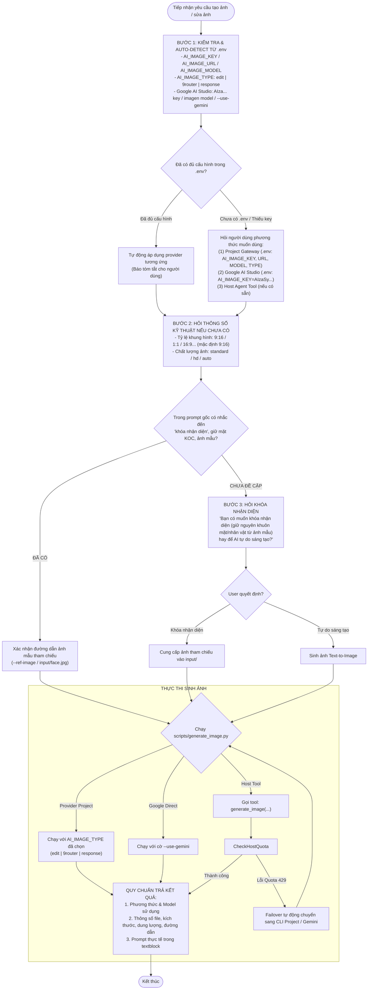

# Image Generate Skill (Project Providers & Google AI Studio Direct)

Kỹ năng tạo và chỉnh sửa ảnh phục vụ sản xuất video ngắn chuẩn KOC (YouTube Shorts, TikTok, Reels) với tỷ lệ dọc 9:16 và bảo toàn chân dung nhân vật / chi tiết sản phẩm.

Skill vận hành theo kiến trúc đa provider đồng bộ với project:
- **Project Providers**:
  - `edit` (mặc định): OpenAI Image Edits API (`/images/edits` - ZPro / OpenAI chuẩn, hỗ trợ `images: [{"id": "input_file_0.png", "image_url": ...}]` và placeholder `[ATTACHED_PHOTO]`).
  - `9router`: OpenAI Image Generations (`/images/generations` với trường `image` flat).
  - `response`: Multimodal Responses API (`/responses` với `input_image` + `input_text` và `tool_choice`).
- **Google AI Studio Direct**: Gọi trực tiếp Google Imagen API (`imagen-3.0-generate-002`).
- **Host Agent Built-in Tool**: Khi phiên làm việc có sẵn tool `generate_image`.

## Quy Chuẩn Bắt Buộc Về Thư Mục Phiên Làm Việc (Session Dir)

> [!IMPORTANT]
> **QUY TẮC CÔ LẬP DỮ LIỆU & BẢO VỆ MÃ NGUỒN**:
> Tuyệt đối **KHÔNG** xả file ảnh được tạo ra, ảnh tham chiếu mẫu hoặc script trung gian trực tiếp ra root repo hoặc `04_canh/` bừa bãi. Mọi tác vụ sinh và xử lý ảnh phải được cô lập hoàn toàn trong thư mục session chuẩn hóa.

- **Thư mục gốc:** `./.scratch/`
- **Cú pháp đặt tên:** `./.scratch/yyyy-mm-dd_image-generate_công-việc-viết-không-dấu`
  - Ví dụ: `./.scratch/2026-10-04_image-generate_tao-anh-koc-ao-polo`
- **Cấu trúc phân vùng thư mục con bắt buộc:**
  ```text
  ./.scratch/yyyy-mm-dd_image-generate_công-việc-viết-không-dấu/
  ├── input/      # Chứa ảnh tham chiếu khóa nhận diện khuôn mặt / chi tiết sản phẩm (`koc_face.jpg`, `product_detail.jpg`)
  ├── output/     # Chứa ảnh sinh ra hoàn thiện (`visual.png`, `scene_01.png`)
  ├── scripts/    # Chứa script prompt builder / batch runner riêng cho session
  └── temp/       # Chứa request JSON payload, raw base64 data, tệp tạm
  ```
- **Tự động phân phối tài nguyên bằng tham số `--session-dir`:**
  - Script `generate_image.py` hỗ trợ tham số `--session-dir <đường_dẫn_session>`.
  - Khi có `--session-dir` và không truyền `--output`, script tự động lưu ảnh vào `<session_dir>/output/visual.png`.
  - Hoặc có thể truyền rõ `--output <session_dir>/output/<tên_file>.png`.

---

## 1. Sơ Đồ Quy Trình Auto-Detect & Khởi Tạo


```mermaid
flowchart TD
    Start(["Tiếp nhận yêu cầu tạo ảnh / sửa ảnh"]) --> Step1["BƯỚC 1: KIỂM TRA & AUTO-DETECT TỪ .env<br/>- AI_IMAGE_KEY / AI_IMAGE_URL / AI_IMAGE_MODEL<br/>- AI_IMAGE_TYPE: edit | 9router | response<br/>- Google AI Studio: AIza... key / imagen model / --use-gemini"]
    
    Step1 --> CheckEnv{"Đã có đủ cấu hình trong .env?"}
    
    CheckEnv -- "Đã đủ cấu hình" --> AutoDetected["Tự động áp dụng provider tương ứng<br/>(Báo tóm tắt cho người dùng)"] --> Step3
    CheckEnv -- "Chưa có .env / Thiếu key" --> AskMethod["Hỏi người dùng phương thức muốn dùng:<br/>(1) Project Gateway (.env: AI_IMAGE_KEY, URL, MODEL, TYPE)<br/>(2) Google AI Studio (.env: AI_IMAGE_KEY=AIzaSy...)<br/>(3) Host Agent Tool (nếu có sẵn)"] --> Step3
    
    %% BƯỚC 3: HỎI THÔNG SỐ KHUNG HÌNH & CHẤT LƯỢNG
    Step3["BƯỚC 2: HỎI THÔNG SỐ KỸ THUẬT NẾU CHƯA CÓ<br/>- Tỷ lệ khung hình: 9:16 / 1:1 / 16:9... (mặc định 9:16)<br/>- Chất lượng ảnh: standard / hd / auto"]
    Step3 --> CheckPromptIdentity{"Trong prompt gốc có nhắc đến<br/>'khóa nhận diện', giữ mặt KOC, ảnh mẫu?"}
    
    CheckPromptIdentity -- "ĐÃ CÓ" --> CollectRef["Xác nhận đường dẫn ảnh mẫu tham chiếu<br/>(--ref-image / input/face.jpg)"] --> ExecGen
    CheckPromptIdentity -- "CHƯA ĐỀ CẬP" --> AskIdentity["BƯỚC 3: HỎI KHÓA NHẬN DIỆN<br/>'Bạn có muốn khóa nhận diện (giữ nguyên khuôn mặt/nhân vật từ ảnh mẫu)<br/>hay để AI tự do sáng tạo?'"]
    
    AskIdentity --> UserIdentityChoice{User quyết định?}
    UserIdentityChoice -- "Khóa nhận diện" --> RequestRef["Cung cấp ảnh tham chiếu vào input/"] --> ExecGen
    UserIdentityChoice -- "Tự do sáng tạo" --> FreeGen["Sinh ảnh Text-to-Image"] --> ExecGen
    
    %% THỰC THI
    subgraph Execution ["THỰC THI SINH ẢNH"]
        ExecGen{"Chạy scripts/generate_image.py"}
        ExecGen -- "Provider Project" --> CallProject["Chạy với AI_IMAGE_TYPE đã chọn<br/>(edit | 9router | response)"] --> OutputStandard
        ExecGen -- "Google Direct" --> CallGemini["Chạy với cờ --use-gemini"] --> OutputStandard
        ExecGen -- "Host Tool" --> CallHost["Gọi tool: generate_image(...)"] --> CheckHostQuota
        CheckHostQuota -- "Lỗi Quota 429" --> Failover["Failover tự động chuyển sang CLI Project / Gemini"] --> ExecGen
        CheckHostQuota -- "Thành công" --> OutputStandard
    end
    
    OutputStandard["QUY CHUẨN TRẢ KẾT QUẢ:<br/>1. Phương thức & Model sử dụng<br/>2. Thông số file, kích thước, dung lượng, đường dẫn<br/>3. Prompt thực tế trong textblock"] --> Done(["Kết thúc"])
```

---

## 2. Giao Thức Tương Tác Của Agent

### Bước 1: Auto-Detect Cấu Hình từ `.env`
Kiểm tra file `.env` tại thư mục gốc:
- **Project Providers**:
  - `AI_IMAGE_KEY` (hoặc `AI_IMAGE_API_KEY`)
  - `AI_IMAGE_URL` (hoặc `AI_IMAGE_ENDPOINT_URL`)
  - `AI_IMAGE_MODEL`
  - `AI_IMAGE_TYPE`: `edit` (ZPro / OpenAI Image Edits), `9router` (Flat image generations), hoặc `response` (OmniRoute responses).
- **Google AI Studio Direct**:
  - `AI_IMAGE_USE_GEMINI=true` HOẶC `AI_IMAGE_KEY` bắt đầu bằng `AIzaSy...` HOẶC `AI_IMAGE_MODEL` chứa `imagen-`.

*Nếu `.env` đã có cấu hình hợp lệ, Agent thông báo ngắn gọn provider được chọn và chuyển ngay sang bước thông số, không hỏi lại rườm rà.*

### Bước 2: Xác nhận Thông số Kỹ thuật
- **Tỷ lệ khung hình**: `9:16` (mặc định video ngắn), `1:1`, `16:9`, `3:4`, `4:3`, `2:3`, `3:2`.
- **Chất lượng ảnh**: `auto`, `standard`, hoặc `hd`.

### Bước 3: Xác nhận Khóa Nhận Diện (Identity Lock)
- Quét từ khóa: `"khóa mặt"`, `"giữ nguyên mặt"`, `"lock identity"`, `"consistency"`, `"giữ nhân vật"`, `"ảnh mẫu"`, `"mặt KOC"`.
- Nếu chưa có: hỏi người dùng muốn khóa nhận diện hay tự do sáng tạo.
- Khi khóa nhận diện: đặt ảnh tham chiếu vào `.scratch/.../input/` và truyền `--ref-image`. Nếu dùng provider `edit`, prompt tự động ánh xạ với `[ATTACHED_PHOTO]` (chuẩn ZPro).

---

## 3. Cơ Chế Failover (Xử Lý Lỗi Quota)

Khi gọi API hoặc Host Tool gặp lỗi Quota / 429:
1. Thông báo rõ lỗi upstream và provider hiện tại.
2. Tự động chuyển đổi hoặc đề xuất chuyển giữa:
   - Project Provider (`AI_IMAGE_URL` / `AI_IMAGE_TYPE`)
   - Google AI Studio Direct (`--use-gemini`)
3. Giữ nguyên thông số tỷ lệ, chất lượng và ảnh tham chiếu đã xác nhận.

---

## 4. Quy Chuẩn Trả Kết Quả

Trình bày theo format chuẩn:
1. Nêu rõ phương thức (`project-edit`, `project-9router`, `project-response`, hoặc `google-ai-studio`) và model.
2. Thông số kỹ thuật: Tỷ lệ, kích thước, chất lượng, dung lượng, đường dẫn file kết quả trong `.scratch/`.
3. **Prompt thực tế sử dụng**: BẮT BUỘC đặt trong khối markdown textblock.

**Mẫu trả kết quả chuẩn:**
> - Phương thức: Project Provider (`edit` - ZPro Edits)
> - Model: `gpt-image-2`
> - Tỷ lệ & Kích thước: 9:16 (1024x1792)
> - Chất lượng: auto
> - Khóa nhận diện: Đã áp dụng tham chiếu từ `./.scratch/2026-10-04_image-generate_tao-anh-koc/input/face.jpg`
> - File kết quả: `./.scratch/2026-10-04_image-generate_tao-anh-koc/output/visual.png` (1.52 MB)
> 
> **Prompt thực tế đã sử dụng:**
> ```text
> Chân dung KOC nữ người Việt 22 tuổi, diện mạo giữ nguyên theo [ATTACHED_PHOTO], nụ cười tươi tắn tự nhiên, đang cầm và giới thiệu chiếc áo polo màu xanh navy vải cotton cá sấu cao cấp. Khung hình dọc 9:16 chuẩn Shorts, chất lượng hình ảnh chân thực 4K, rõ từng thớ sợi dệt vải.
> ```

---

## 5. Hướng Dẫn Vận Hành CLI Script (`generate_image.py`)

File script: [generate_image.py](scripts/generate_image.py) (100% Pure Python, Zero dependencies).

```bash
SESSION_DIR="./.scratch/2026-10-04_image-generate_demo"
```

### A. Tự động phát hiện cấu hình từ `.env` (Chế độ khuyến nghị)
```bash
python .claude/skills/image-generate/scripts/generate_image.py \
  --prompt "Nữ KOC trẻ trung đang mặc áo polo phối sọc" \
  --aspect-ratio "9:16" \
  --session-dir "$SESSION_DIR"
```

### B. Sinh ảnh có ảnh tham chiếu (Lock Identity / Image-to-Image)
```bash
python .claude/skills/image-generate/scripts/generate_image.py \
  --prompt "KOC nữ diện mạo theo [ATTACHED_PHOTO] đang giới thiệu sản phẩm" \
  --ref-image "$SESSION_DIR/input/koc_face.jpg" \
  --aspect-ratio "9:16" \
  --session-dir "$SESSION_DIR" \
  --output "$SESSION_DIR/output/scene_01.png"
```

### C. Chạy trực tiếp Google AI Studio (`--use-gemini`)
```bash
python .claude/skills/image-generate/scripts/generate_image.py \
  --prompt "Nữ KOC trẻ trung đang mặc áo polo phối sọc" \
  --aspect-ratio "9:16" \
  --use-gemini \
  --session-dir "$SESSION_DIR"
```

### D. Kiểm tra cấu hình không tốn credit (`--dry-run`)
```bash
python .claude/skills/image-generate/scripts/generate_image.py \
  --prompt "Kiểm tra cấu hình" \
  --dry-run
```
