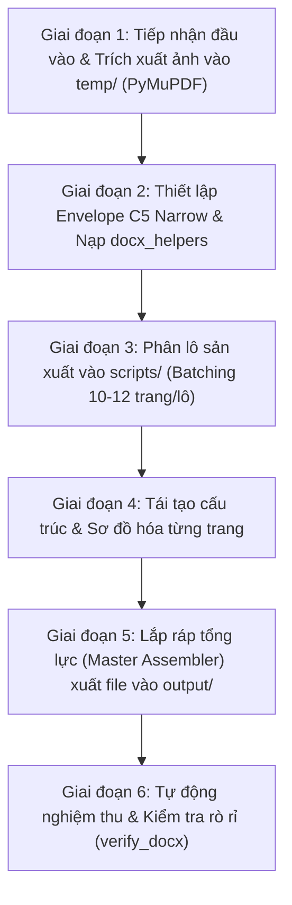

# PDF & IMAGE TO DOCX PRECISION CONVERTER (QUY TRÌNH CHUYỂN ĐỔI CHUẨN IN ẤN)

Skill này cung cấp quy trình công nghệ 6 bước toàn diện giúp Agent chuyển đổi bất kỳ tài liệu nào từ dạng **PDF scan hoặc ảnh chụp sách** sang tệp **Word (.docx)** với độ chính xác tuyệt đối, khớp từng trang và đẹp mắt như bản thiết kế gốc.

---

## 📁 Quy Chuẩn Bắt Buộc Về Thư Mục Phiên Làm Việc (Session Dir)

> [!IMPORTANT]
> **QUY TẮC CÔ LẬP DỮ LIỆU & BẢO VỆ MÃ NGUỒN**:
> Tuyệt đối **KHÔNG** xả file Word sinh ra, file ảnh bóc tách từng trang, file text OCR hoặc các script trung gian (`batch*.py`, `generate_*.py`) trực tiếp ra root repo hoặc thư mục chung bừa bãi. Mọi tác vụ chuyển đổi tài liệu bắt buộc phải được cô lập hoàn toàn trong thư mục session chuẩn hóa.

- **Thư mục gốc:** `./.scratch/`
- **Cú pháp đặt tên:** `./.scratch/yyyy-mm-dd_pdf-image-to-docx_công-việc-viết-không-dấu`
  - Ví dụ: `./.scratch/2026-09-30_pdf-image-to-docx_chuyen-sach-scan`
- **Cấu trúc phân vùng thư mục con bắt buộc:**
  ```text
  ./.scratch/yyyy-mm-dd_pdf-image-to-docx_công-việc-viết-không-dấu/
  ├── input/      # Chứa file PDF gốc, thư mục ảnh chụp/scan gốc, tệp text thô đối chiếu
  ├── output/     # Chứa tệp Word (.docx) hoàn thiện xuất xưởng
  ├── scripts/    # Chứa script phân lô (batch1.py, batch2.py...) và master assembler (generate_<ten_file>.py)
  └── temp/       # Chứa các ảnh trích xuất từng trang (page_1.png, page_2.png...) hoặc file cache trung gian
  ```
- **Khởi tạo session trước khi thực thi:**
  ```bash
  # Cách 1: Tự động qua công cụ chuẩn hóa của repository
  python scripts/skill_session.py --skill pdf-image-to-docx --task chuyen-sach-scan

  # Cách 2: Thiết lập thủ công qua biến môi trường
  SESSION_DIR="./.scratch/2026-09-30_pdf-image-to-docx_chuyen-sach-scan"
  mkdir -p "$SESSION_DIR/input" "$SESSION_DIR/output" "$SESSION_DIR/scripts" "$SESSION_DIR/temp"
  ```

---

## 🎯 1. NGUYÊN TẮC BẤT DI BẤT DỊCH (CORE PILLARS)

> [!IMPORTANT]
> **QUY TẮC SẮT ĐÁ: TUYỆT ĐỐI KHÔNG ĐƯỢC BỊA NỘI DUNG (ZERO HALLUCINATION)**  
> 1. **Trung thành tuyệt đối 100% với nguyên bản:** Từng câu, từng chữ, con số, dấu câu, thuật ngữ, gạch đầu dòng, chú thích trong tài liệu scan/ảnh gốc phải được sao chép nguyên vẹn vào tệp Word.
> 2. **Cấm thêm bớt, tóm tắt hoặc viết lại:** Tuyệt đối KHÔNG ĐƯỢC BỊA thêm bất kỳ từ ngữ nào, không tóm tắt, không "làm mượt" câu văn theo ý mình, không suy diễn hay thay đổi cách hành văn của tác giả.
> 3. **Xử lý chỗ mờ/khó đọc:** Nếu gặp chữ mờ nhòe trong ảnh scan, phải kiểm tra đối chiếu kỹ với file text thô đi kèm hoặc ghi rõ `[chữ mờ/cần đối chiếu]`, **tuyệt đối không được tự ý bịa ra từ ngữ khác**.

1. **Chuẩn kích thước Envelope C5 & Căn lề Narrow:**
   * **Khổ giấy:** Luôn là **Envelope C5** (162 mm × 229 mm / 6.38" × 9.02").
   * **Căn lề:** Luôn là **Narrow** (Lề hẹp 0.5 inch / 12.7 mm ở cả 4 cạnh: Top, Bottom, Left, Right).
   * **Vùng nội dung:** Rộng đúng 5.38 inch (136.6 mm), các bảng và banner tự động co giãn theo khổ này.
2. **Khớp trang 1:1 tuyệt đối:** PDF có $N$ trang $\implies$ DOCX có đúng $N$ trang ($N-1$ ngắt trang tường minh). Tuyệt đối không để dồn trang hay tràn trang tự do.
3. **Bảo toàn 100% câu từ (Zero-loss Fidelity):** Giữ nguyên từng chữ, dấu câu, số liệu, thuật ngữ. Không tóm tắt, không viết lại theo cảm xúc.
4. **Tái tạo thị giác thành Bảng Word (Visual-to-Table Engine):** Toàn bộ sơ đồ luồng, bảng đối chiếu (Sai vs Đúng), thẻ chỉ số KPI, timeline lộ trình được vẽ lại bằng Word Table có màu nền, viền và icon sinh động. Không chèn ảnh chụp mờ nhòe.
5. **Cây điều hướng Left Navigation sắc nét:** Đánh dấu chuẩn `Heading 1` cho Phần/Chương và `Heading 2` cho các banner đề mục, giúp người đọc tra cứu tức thì trên thanh Navigation của Word.
6. **Cách ly rò rỉ Running Header/Footer:** Lọc sạch 100% các dòng tiêu đề lặp và số trang in nổi trôi dạt vào thân bài.

---

## 📋 2. QUY TRÌNH THỰC THI 6 GIAI ĐOẠN (6-PHASE SOP)



---

### 🔹 GIAI ĐOẠN 1: TIẾP NHẬN ĐẦU VÀO & KHẢO SÁT THỊ GIÁC

Đặt tài liệu nguồn vào `$SESSION_DIR/input/`. Skill hỗ trợ 2 kịch bản đầu vào:

* **Trường hợp A — Người dùng đưa Tệp PDF nguồn (`$SESSION_DIR/input/document.pdf`):**
  Tự động chạy kịch bản trích xuất toàn bộ các trang thành ảnh PNG sắc nét (DPI 150) lưu vào `$SESSION_DIR/temp/`:
  ```bash
  python skills/pdf-image-to-docx/scripts/render_pdf_pages.py "$SESSION_DIR/input/document.pdf" "$SESSION_DIR/temp" 150
  ```

* **Trường hợp B — Thư mục ĐÃ CÓ SẴN ẢNH (`$SESSION_DIR/input/images/`):**
  **Bỏ qua hoàn toàn bước trích xuất PDF!** Chạy ngay công cụ quét để sắp xếp tự nhiên (`page_1, page_2... page_10`), đếm tổng số trang $N$ và kiểm tra hướng ảnh:
  ```bash
  python skills/pdf-image-to-docx/scripts/scan_image_folder.py "$SESSION_DIR/input/images"
  ```

* **Xử lý tài liệu gốc kèm theo:** Nếu có tệp `.docx` hoặc `.txt` thô kèm theo trong `$SESSION_DIR/input/`, đọc trước toàn bộ danh sách đoạn văn để đối chiếu câu từ gốc, tránh lỗi gõ sai chữ do OCR.
* **Lập kế hoạch dàn trang:** Xác định tổng số trang $N$, danh sách các Chương (Heading 1) và các đề mục lớn (Heading 2) để chuẩn bị chia lô (batching).

---

### 🔹 GIAI ĐOẠN 2: THIẾT LẬP ENVELOPE C5 NARROW & NẠP THƯ VIỆN HELPERS

Mọi file script dựng tài liệu đều kế thừa từ bộ thư viện dùng chung `docx_helpers.py`:
* **Thiết lập khổ trang Envelope C5:** Rộng 6.38" (162 mm), Cao 9.02" (229 mm).
* **Căn lề Narrow:** 0.5" (12.7 mm) tất cả 4 cạnh (Top, Bottom, Left, Right).
* **Làm sạch Header/Footer:** Xóa toàn bộ đoạn văn trong header/footer và ngắt link liên kết (`is_linked_to_previous = False`).
* **Normal Style:** Font Arial, cỡ chữ 10pt, màu `#1E293B` (Slate 800), giãn dòng 1.15, khoảng cách đoạn `space_after = 6pt`.

```python
import docx_helpers as h
doc = docx.Document()
h.setup_document_c5_narrow(doc, font_name="Arial", base_font_size=10)
```

---

### 🔹 GIAI ĐOẠN 3: PHÂN LÔ SẢN XUẤT (BATCHING STRATEGY)

Để tránh quá tải bộ nhớ và đảm bảo kiểm soát chất lượng chi tiết từng trang:
* Chia tài liệu thành các file lô nhỏ đặt tại `$SESSION_DIR/scripts/` (mỗi file phụ trách **10–12 trang**):
  * `$SESSION_DIR/scripts/batch1.py` (Trang 1 đến 12)
  * `$SESSION_DIR/scripts/batch2.py` (Trang 13 đến 24)
  * `$SESSION_DIR/scripts/batch3.py` (Trang 25 đến 36)
* Kế thừa từ mẫu khung chuẩn tại [scripts/template_batch.py](./scripts/template_batch.py).

---

### 🔹 GIAI ĐOẠN 4: TÁI TẠO CẤU TRÚC & SƠ ĐỒ HÓA TỪNG TRANG

Trong mỗi trang thuộc từng Batch, tuân thủ nghiêm ngặt:
1. **Comment chỉ số trang rõ ràng:** `# --- TRANG X (Tương ứng page_X.png) ---`.
2. **Tiêu đề Chương (Heading 1):** Gọi `h.add_chapter_title(doc, "CHƯƠNG X", "TÊN CHƯƠNG")`.
3. **Đề mục Banner (Heading 2):** Gọi `h.add_heading_2_banner(doc, "TÊN ĐỀ MỤC", bg_hex="E2E8F0")`.
4. **Văn bản & Gạch đầu dòng:** Gọi `h.add_body_p(doc, runs)` và `h.add_bullet_p(doc, runs)`.
5. **Tái tạo hình ảnh thành Bảng Word (Tra cứu chi tiết tại [table-styling-guide.md](./references/table-styling-guide.md)):**
   * *So sánh đối chiếu (2 cột):* Gọi `h.add_comparison_cards(doc, left_card, right_card)`.
   * *Quy trình ngang (Mũi tên/Bước làm):* Gọi `h.add_process_steps(doc, steps_list)`.
   * *Hộp chỉ số KPI / Case Study:* Gọi `h.add_stat_boxes(doc, stats_list)`.
   * *Khung QR Code / Video hướng dẫn:* Gọi `h.add_qr_callout(doc, text_runs)`.
6. **Ngắt trang tường minh:** Gọi `h.add_explicit_page_break(doc)` ở cuối mỗi trang (NGOẠI TRỪ trang cuối cùng của tài liệu).

---

### 🔹 GIAI ĐOẠN 5: LẮP RÁP TỔNG LỰC (MASTER ASSEMBLER)

Tạo file điều phối tổng `$SESSION_DIR/scripts/generate_<ten_file>.py` (kế thừa từ mẫu [scripts/template_assembler.py](./scripts/template_assembler.py)):
1. Khởi tạo `doc = docx.Document()`.
2. Cấu hình lề Narrow và khổ Envelope C5 (`h.setup_document_c5_narrow(doc)`).
3. Lần lượt gọi các hàm nạp theo thứ tự: `batch1.add_batch_1(doc)`, `batch2.add_batch_2(doc)`, `batch3.add_batch_3(doc)...`
4. Lưu file đầu ra vào thư mục `$SESSION_DIR/output/`:
   ```bash
   python "$SESSION_DIR/scripts/generate_<ten_file>.py" --output "$SESSION_DIR/output/<ten_tai_lieu>.docx"
   ```

---

### 🔹 GIAI ĐOẠN 6: TỰ ĐỘNG NGHIỆM THU & KIỂM ĐỊNH (VERIFICATION)

Chạy ngay kịch bản kiểm tra chất lượng tự động:
```bash
python skills/pdf-image-to-docx/scripts/verify_docx.py "$SESSION_DIR/output/<ten_tai_lieu>.docx" <expected_pages>
```

**Bảng Tiêu Chí Nghiệm Thu (Acceptance Checklist):**
- [ ] Số ngắt trang chính xác bằng $N - 1$ (Tổng số trang đạt đúng $N$).
- [ ] Số lượng Heading 1 và Heading 2 hiển thị đầy đủ trên Navigation Pane của Word.
- [ ] Rò rỉ Header/Footer = 0 (Không còn số trang trôi nổi, không còn dòng tiêu đề sách mép trang lọt vào nội dung).
- [ ] Tất cả bảng biểu, sơ đồ hiển thị căn giữa, có padding và màu nền rõ nét.
- [ ] Độ khớp văn bản 100% so với bản gốc.

---

## 🛠️ 3. DANH MỤC CÔNG CỤ & TÀI NGUYÊN SẴN CÓ

| File / Thư mục | Mục đích sử dụng |
| :--- | :--- |
| [scripts/render_pdf_pages.py](./scripts/render_pdf_pages.py) | Kịch bản tự động xuất file PDF thành các file ảnh PNG độ nét cao vào thư mục `temp/` (PyMuPDF). |
| [scripts/scan_image_folder.py](./scripts/scan_image_folder.py) | Kịch bản tự động quét và sắp xếp tự nhiên thư mục ảnh chụp/scan có sẵn. |
| [scripts/docx_helpers.py](./scripts/docx_helpers.py) | Thư viện tạo bảng, banner đề mục, box chỉ số, XML cell margins/borders/shading. |
| [scripts/verify_docx.py](./scripts/verify_docx.py) | Kịch bản tự động kiểm tra số trang, ngắt trang, navigation tree và rò rỉ header. |
| [scripts/template_batch.py](./scripts/template_batch.py) | Mẫu khung chuẩn viết file batch 10-12 trang trong `scripts/`. |
| [scripts/template_assembler.py](./scripts/template_assembler.py) | Mẫu khung chuẩn viết file lắp ráp master xuất ra `output/`. |
| [references/table-styling-guide.md](./references/table-styling-guide.md) | Cẩm nang chi tiết bảng màu Hex và các dạng sơ đồ thị giác chuyển đổi thành Table. |
| [references/pagination-and-rules.md](./references/pagination-and-rules.md) | Kỷ luật căn trang 1:1, bảo toàn câu từ và xử lý dị thường trong bản scan. |
